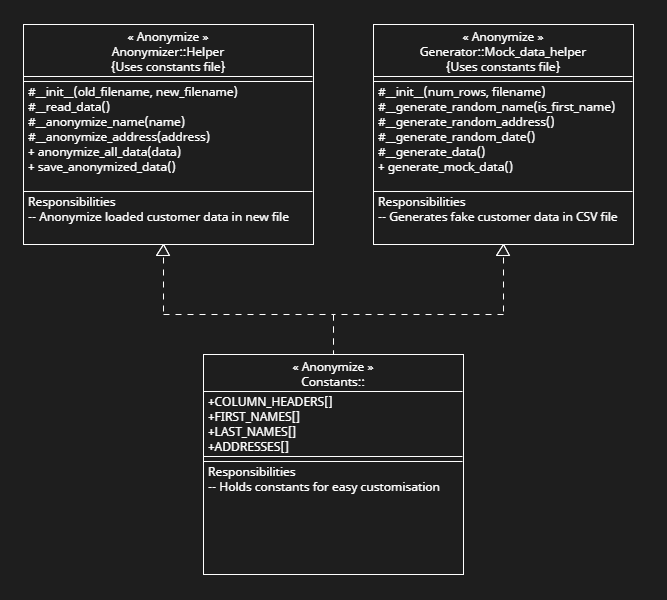

# LF-Coding-Challenge
Files for a coding assessment provided by LF.

## Anonymize customer information

I chose to focus on problem statement 1, anonymizing customer information. The full specifications can be seen at the bottom of this README. My code will both generate mock csv customer data AND anonymize said data. Each processes is completely seperate, using individual classes within a package and with external unit testing.

- [x] Creates mock data
- [x] Anonymizes created mock data
- [x] Full modularity
- [x] Unit tests
- [x] UML design
- [x] Easy execution with command prompt necessary

## How to execute
### For the easy method with tests, just double click `run.bat` 📜

To run with docker (with containerised csv outputs) use
```
docker build python-lf-challenge
docker run python-lf-challenge
```

To execute main functions with csv outputs 
```
python run.py 
```

The output files will be in `output/*` 


To run individual test files use
```
python test_anonymizer.py
python test_generator.py
```
The output files for tests are put in a temporary location and deleted straight after

## Assumptions
 - Due to no exact anonymization method specified in the specs, I opted to pseudo-anonymize the data requested. All first names and last names will have the first letter unchanged and all street names still have the same suffix.

    `John,Smith,48 Blueberry Ave,17/12/1967` becomes `Jadiek,Smzjwn,11 cxkmh Ave,17/12/1967`

 - There are no duplicates
 - The address will always be in three parts
 - The date is in `ddmmyyyy` format

## Package UML


---

Below are the assessment specifications:
```md
# Data Engineering Coding Challenge
Hi, thank you for your time in solving the coding challenge. The goal is to see how your approach to problem-solving, and how you structure your code and hand it over to the team for review.

You can solve any one of the following problem statements. This README describes evaluation criteria, problem statements, and also some of the choices which you might have to make. If you need any further information, please reach out we are happy to help.

## Evaluation Criteria
- Code structure, and README instructions to review and run code
- Basic engineering principles
- Testing strategies

## Problem Statement - 1 (Anonymize customer information)
Imagine you are working on a project where you have to process customer data and generate insights. Considering this data has customer information and to generate insights, multiple teams will be using this data. To ensure we handle customer information with care, and not make it visible to everyone on the team one requirement is to anonymize customer information before it's loaded into the warehouse for insights generation.

- You will get this data in CSV files which will have customer personal information like first_name, last_name, address, date_of_birth
- Write code to generate a CSV file containing first_name, last_name, address, date_of_birth
- Load generated CSV in the previous step, anonymize data, and output anonymized data to a different file
- Columns to anonymise are first_name, last_name and address

## Problem Statement - 2 (Parse fixed width file)
To support different analytics and reporting functions, Data engineering teams often work with data coming from different systems. All of the systems don't support the same file formats. Consider one system can only send data in fixed-width file format, and to be able to load this data into a database you have to convert it into a CSV file format.

- Generate a fixed-width file using the provided spec `spec.json` (offset provided in the spec file represent the length of each field)
- Implement a parser that can parse the fixed width file and generate a delimited CSV file
- DO NOT use python libraries like pandas for parsing. You can use the standard library to write out a CSV file

## Choices
- You can use any language or any platform
- You can use any package or library unless specified in coding challenge
- Bonus points if you bundle your code using Docker(Dockerfile) that can be used to run the code
- You can share code either using Github, bitbucket, or zip in the email
- We are not expecting to enter data on command prompt, you can use any faker library to generate mock data
- Include a README file describing how we can run and test
```